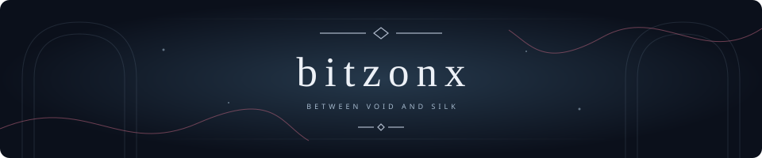
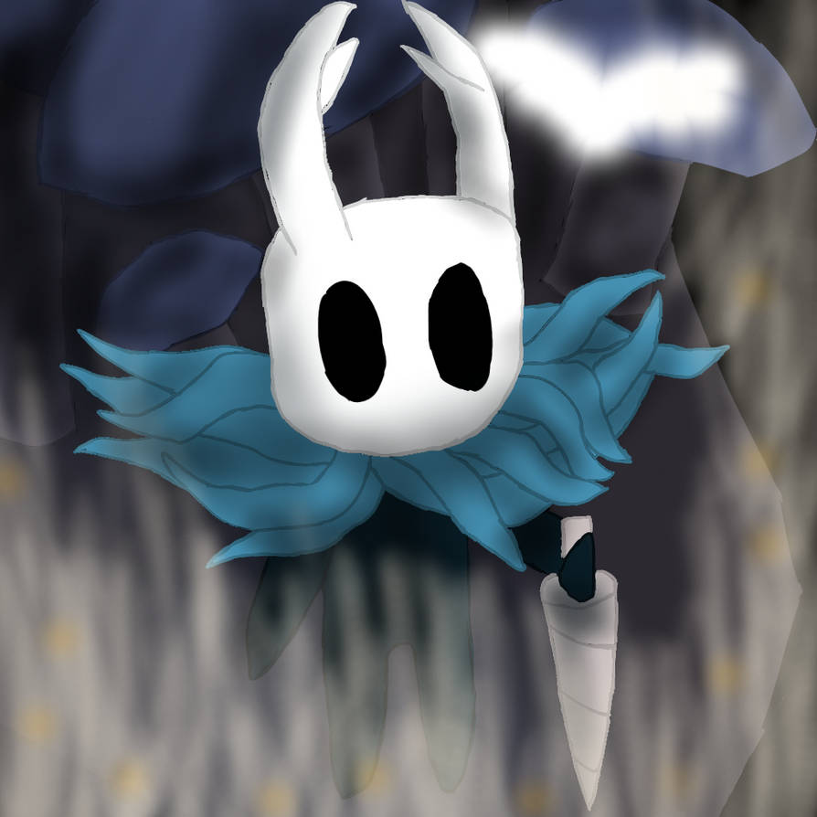

  

C O D E &nbsp; · &nbsp; C U R I O S I T Y &nbsp; · &nbsp; Q U I E T &nbsp; W O R L D S

 

  

  Art by <a href="https://www.deviantart.com/meltdown-gaming/art/Knight-Hollow-Knight-903797240">MelTdown-Gaming</a> · <a href="https://creativecommons.org/licenses/by/3.0/">CC BY 3.0</a>

 

  <h3>Rest a while, traveler.</h3>
  
A quiet corner for code, small experiments, and the next thread worth following.

  

CHOOSE YOUR NEXT PASSAGE

  
  &nbsp;&nbsp;
  

 

<em>Build something small. Follow the thread.</em> Leave a light for the next traveler.

 

  
   
  Inspired by Hollow Knight &amp; Silksong · Worlds and characters by Team Cherry

