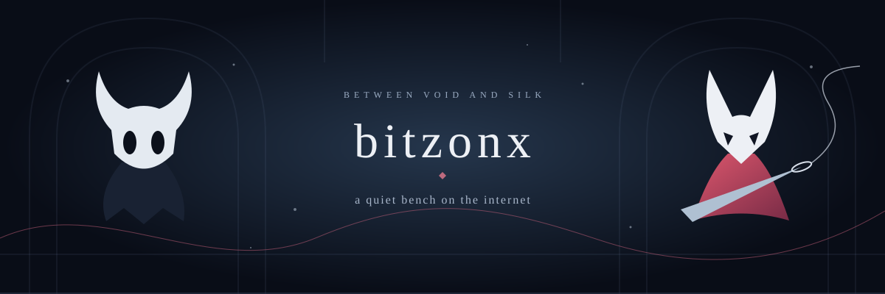

  

  
  &nbsp;
  

 

<h2 align="center">Rest a while, traveler.</h2>

  You've found my little corner of the caverns. 
  A place for code, curiosity, and whatever waits down the next passage.

 

<h3 align="center">A map, still unfolding</h3>

  Every repository is another room to explore. 
  Some hold small experiments. Others leave a thread to follow. 
  Take a look around. There's no rush to reach the surface.

 

  
The inscription on the bench

   
  <blockquote>
    Build something small. Follow the thread. Leave a light for the next traveler.
  </blockquote>
  

    Inspired by the worlds of <em>Hollow Knight</em> and <em>Hollow Knight: Silksong</em>.
    Original fan-made banner and prose; the games and their characters belong to Team Cherry.
  

 

Until the next bench. ◇

